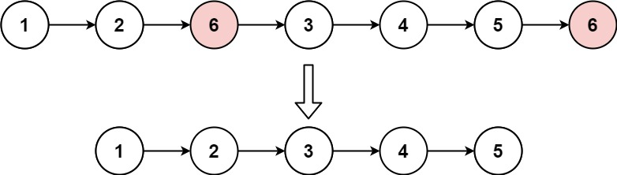

## 203. Remover Elementos de uma Lista Encadeada

#### Dificuldade: Fácil
#### Link: https://leetcode.com/problems/remove-linked-list-elements/

Dada a cabeça (`head`) de uma lista encadeada e um inteiro `val`, remova todos os nós cujo `Node.val == val` e retorne a nova cabeça.

Exemplo 1:

Entrada: `head = [1,2,6,3,4,5,6]`, `val = 6`

Saída: `[1,2,3,4,5]`

Exemplo 2:

Entrada: `head = []`, `val = 1`

Saída: `[]`

Exemplo 3:

Entrada: `head = [7,7,7,7]`, `val = 7`

Saída: `[]`

Restrições:

* O número de nós na lista está no intervalo `[0, 10^4]`.
* `1 <= Node.val <= 50`
* `0 <= val <= 50`

#### Abordagem

Usa-se um nó dummy apontando pra `head`, evitando tratamento especial quando os primeiros nós da lista já batem com `val`. Um ponteiro `current`, iniciado no dummy, percorre a lista: sempre que `current->next->val` é igual a `val`, o nó seguinte é pulado (`current->next = current->next->next`); caso contrário, `current` avança normalmente. Ao final, `dummy->next` é a nova cabeça, já sem os nós removidos. Complexidade O(n) de tempo e O(1) de espaço, sendo n o número de nós da lista.
